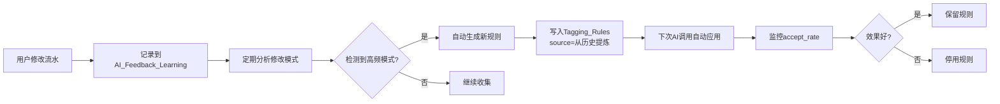

# 个人记账分析系统 · 字段级建模说明文档（口径 + 示例）PRDv1.3

> **文档定位**：字段级数据字典 + 统一分析口径 + AI 记账可落地约束  
> **版本特点**：AI 友好优先 + 效率至上 + 自我迭代优化 + 轻账户进化版

---

## 📋 版本说明 v1.3

### 核心原则（铁原则）
1. ✅ **AI 识别友好** - 简化输入输出，贴近自然语言
2. ✅ **效率优先** - 不过度规范化，应用层校验优于数据库约束
3. ✅ **自我迭代优化** - 从用户反馈中学习，持续改进
4. ❌ **拒绝完美主义** - 不追求完美但操作繁琐的方案

### v1.3 核心改进

#### 🔧 精简业务场景
1. **精简交易类型** (0.1节、9.1节)
   - `type=资产变动` **仅用于**大额预付付款当下（如年付房租）
   - 移除转账、还款、借贷等资产流转场景
   - 大额预付：**预付+月度摊销**（强烈推荐），Step1 资产变动、Step2 支出
   
2. **完善AI输出映射** (1节、13.5节)
   - Transaction增加`ai_metadata`字段，存储AI决策依据
   - Transaction增加`source_type`/`source_id`，支持关联追溯

3. **补充现代支付渠道** (9.2节)
   - 新增：花呗、数字人民币、Apple Pay、云闪付

4. **简化预付费用** (4节)
   - 预付总价可选记录
   - 摊销记为正常支出（is_analysis=是）

#### 🚀 增强迭代能力
5. **AI反馈学习机制** (15节 新增)
   - AI_Generation_Log增加用户反馈字段
   - 新增AI_Feedback_Learning表，从修改中学习

6. **规则自动提炼** (12.1节增强)
   - Tagging_Rules增加效果追踪字段
   - 支持从用户行为自动生成规则

7. **分类智能优化** (2节增强)
   - Category增加使用统计字段
   - AI根据使用频率优化推荐顺序

#### ⚡ 性能优化
8. **补充核心索引** (11.3节)
   - 新增：余额计算、标签查询、订阅查询索引

### v1.3 vs v1.2 差异速查

| 改动项 | v1.2 | v1.3 | 理由 |
|-------|------|------|------|
| 交易类型 | 3种 | 3种 | **资产变动仅用于**大额预付付款当下（10.5节） |
| 特殊场景 | 9种 | 5种 | 移除转账/借贷；**保留预付+月度摊销**（强烈推荐） |
| 预付口径 | 付款=资产变动 | 同左 | Step1 资产变动、Step2 支出；钱没花完、"存在未来" |
| AI元数据 | 无 | ai_metadata字段 | 可解释性+反馈学习 |
| 关联追溯 | 无 | source_type/source_id | 含 prepaid_payment / prepaid_amortization |
| 支付渠道 | 6种 | 10种 | 覆盖现代支付方式 |
| 反馈学习 | 无 | 新增15节 | 自我迭代优化核心 |
| 分类约束 | 逻辑约束 | 应用层校验+AI学习 | 效率优先 |

---

## 0. 全局口径与通用约定

### 0.1 金额方向与分析口径（交易类型）

- **amount**：Decimal(15,2)，采用"带符号金额"。
  - 支出为负（`amount < 0`）
  - 收入为正（`amount > 0`）
  - 金额不允许为0
- **type**：交易类型
  - **收入**：真实收入（工资、退款等）
  - **支出**：真实消费（日常消费、摊销等）
  - **资产变动**：**仅用于大额预付付款当下**（钱没花完，只是"存在未来"），见第4节、10.5节
- **is_analysis**：是否计入"消费分析/预算执行"口径。
  - 默认消费口径：`type=支出 AND is_analysis=是`
  - 默认收入口径：`type=收入 AND is_analysis=是`

**v1.3说明**：
- `type=资产变动` **仅用于**：大额一次性预付的付款当下（如年付房租），配合月度摊销使用
- 不涉及转账、还款、借贷等资产流转场景

### 0.2 轻账户策略（降低记账难度）

日常记账**只强制**记录"你用什么付的"，不强制记录具体资金账户：

- **payment_channel（必填）**：现金/微信/支付宝/银行卡/信用卡/花呗/数字人民币/Apple Pay/云闪付/其他
- **account_name（可选）**：招商信用卡/建行储蓄卡…（仅在你启用余额/净资产/对账时再补齐）

**v1.3 优化**：
- payment_channel扩充到10种，覆盖现代支付方式
- 轻账户允许account_name为空，但amount必须准确（不再允许amount=0的简化记录）

### 0.3 日期与时间

- `date`：业务发生日期（用于月度统计）
- `created_at`：记录创建时间（审计/追溯）
- 默认时区由系统配置（建议后续引入 `user_timezone`）

### 0.4 多用户/多账本（建议预留）

若未来要多人/多账本，建议所有事实表增加：

- `user_id`
- `ledger_id`

---

## 1. 记账流水表（Transaction）

| 字段名 | 类型 | 业务口径说明 | 示例 |
| --- | --- | --- | --- |
| transaction_id | String(50) | 流水唯一标识 | TX20240115001 |
| date | Date | 资金实际发生日期 | 2024-01-15 |
| type | Enum | 交易类型（见 9.1） | 支出 |
| level1_category | String(50) | 一级分类（应用层校验与Category一致） | 生活支出 |
| level2_category | String(50) | 二级分类（应用层校验与Category一致） | 餐饮 |
| amount | Decimal(15,2) | 金额：收入为正、支出为负；**不允许为0** | -35.00 |
| payment_channel | Enum | 支付渠道（必填，见 9.2） | 微信 |
| account_name | String(100) | 具体账户（可空，可后补） | 招商信用卡 |
| tags | Text | 标签（存为 JSON 数组；可空） | ["工作","计划内"] |
| description | String(200) | 备注/摘要 | 午餐外卖 |
| is_analysis | Boolean | 是否计入消费分析 | 是 |
| **source_type** ⭐ | Enum | 来源类型（见 9.10） | ai_generated |
| **source_id** ⭐ | String(50) | 来源关联ID（可空） | SUB001 / PRE202401 |
| **ai_metadata** ⭐ | JSON | AI决策元数据（可空，见1.1） | {...} |
| created_at | DateTime | 创建时间 | 2024-01-15 12:30 |
| updated_at | DateTime | 最后修改时间 | 2024-01-15 14:20 |

**v1.3 新增字段说明**：

### 1.1 source_type / source_id（关联追溯）

**设计原则**：最小化关联，只加必要的追溯能力。

| source_type | source_id示例 | 说明 |
|-------------|--------------|------|
| manual | NULL | 手工录入 |
| ai_generated | L202601280001 | AI生成，source_id=AI_Generation_Log.log_id |
| subscription | SUB001 | 订阅扣款，source_id=Subscription.subscription_id |
| prepaid_payment | PRE202401 | 预付付款（付款当下），type=资产变动 |
| prepaid_amortization | PRE202401 | 预付摊销（每月一笔），type=支出 |

**用途**：
- 快速追溯：这条流水是AI生成还是手工录入？
- 关联查询：查询某订阅的所有扣款历史
- A/B测试：对比不同AI版本生成的流水质量

### 1.2 ai_metadata（AI决策元数据）

**设计原则**：AI友好，存储可解释性信息，支持反馈学习。

**JSON结构**：
```json
{
  "log_id": "L202601280001",           // 关联到AI_Generation_Log
  "confidence": 0.85,                  // 置信度
  "reasons": [                         // 决策依据
    "命中规则R001：夜宵默认冲动",
    "金额35元匹配历史餐饮模式"
  ],
  "risk_flags": [],                    // 风险标记（如"low_confidence", "ambiguous_date"）
  "alternatives": [                    // 备选方案（可选）
    {"level2_category": "咖啡茶饮", "confidence": 0.12}
  ],
  "user_modified": false,              // 用户是否修改过
  "modified_fields": []                // 用户修改了哪些字段（如["level2_category", "tags"]）
}
```

**用途**：
- **可解释性**：事后追溯AI为什么这样分类
- **反馈学习**：识别用户修改模式，优化AI模型
- **质量监控**：统计低置信度流水占比

**规则**：
- `account_name` 允许为空；对账时可后续补全。
- 标签直接存 `Transaction.tags`（JSON 数组字符串），AI 输出友好。
- **v1.3 强调**：`amount` 不允许为0（即使轻账户也要记录真实金额）
- 分类不使用数据库外键，采用应用层校验+AI自学习纠错（效率优先）

---

## 2. 分类维表（Category）

| 字段名 | 类型 | 口径说明 | 示例 |
| --- | --- | --- | --- |
| level1_category | String(50) | 一级分类唯一名称 | 生活支出 |
| level2_category | String(50) | 二级分类（在一级下唯一） | 餐饮 |
| default_type | Enum | 默认交易类型（见 9.1） | 支出 |
| default_is_analysis | Boolean | 默认是否计入分析 | 是 |
| **usage_count** ⭐ | Int | 使用次数统计（自我优化） | 1523 |
| **last_used_at** ⭐ | DateTime | 最后使用时间 | 2024-01-15 12:30 |
| **is_active** ⭐ | Boolean | 是否启用（默认true） | 是 |
| remark | String(200) | 分类说明 | 高频日常消费类 |

**v1.3 新增字段说明**：

- **usage_count**：每次使用该分类时+1，AI可根据使用频率优化推荐顺序
- **last_used_at**：记录最后使用时间，识别"僵尸分类"（长期未用）
- **is_active**：支持分类下线（历史数据保留，新流水不推荐）

**主键**：`(level1_category, level2_category)` 联合主键

**应用层校验规则（v1.3 强调）**：
- Transaction写入时，检查分类是否存在于Category表
- 如不存在，记录到"异常分类日志"，提示用户确认或AI自动建议相近分类
- 不使用数据库外键（避免灵活性损失，允许导入时快速创建新分类）

---

## 3. 账户表（Account，可选高级能力）

> 轻账户版不强制启用；启用后可计算余额/净资产/对账。

| 字段名 | 类型 | 口径说明 | 示例 |
| --- | --- | --- | --- |
| account_name | String(100) | 账户名称（唯一） | 招商信用卡 |
| account_type | Enum | 账户类型（见 9.3） | 信用卡 |
| opening_balance | Decimal(15,2) | 初始余额（**v1.3改为NOT NULL，默认0**） | 5000.00 |
| is_asset | Boolean | 是否计入净资产 | 否 |
| remark | String(200) | 账户说明 | 主用消费卡 |

**余额/净资产口径（可选）**：

- 账户余额（某日）：\( opening\_balance + \sum amount \)（按 `date` 过滤至该日）
- 净资产：Σ 资产账户余额 - Σ 负债账户余额

**v1.3 优化**：
- `opening_balance` 改为 NOT NULL DEFAULT 0（避免NULL值导致余额计算失败）
- 若不知道初始余额，设为0，后续通过"余额调整"流水校准

---

## 4. 预付费用表（Prepaid_Expense）

| 字段名 | 类型 | 口径说明 | 示例 |
| --- | --- | --- | --- |
| prepaid_id | String(50) | 预付事项ID | PRE202401 |
| expense_name | String(100) | 预付事项名称 | 2024年房租 |
| level1_category | String(50) | 最终计入消费一级分类 | 生活支出 |
| level2_category | String(50) | 最终计入消费二级分类 | 住房 |
| total_amount | Decimal(15,2) | 预付总金额（正数） | 12000.00 |
| start_month | YearMonth | 开始摊销月份 | 2024-01 |
| end_month | YearMonth | 结束摊销月份 | 2024-12 |
| months | Int | 总摊销月数 | 12 |
| monthly_amount | Decimal(15,2) | 每月摊销金额 | 1000.00 |
| payment_channel | Enum | 付款渠道（轻账户必填） | 银行卡 |
| **account_name** ⭐ | String(100) | 付款账户（可空） | 招商信用卡 |
| **payment_transaction_id** ⭐ | String(50) | 付款流水ID（可空） | TX20240101001 |
| **last_amortized_month** ⭐ | YearMonth | 已摊销到哪个月 | 2024-05 |
| status | Enum | 进行中/已完成（见 9.4） | 进行中 |
| remark | String(200) | 备注 | 年付房租 |

**v1.3 新增字段说明**：

- **account_name**：与Transaction设计一致，支持对账
- **payment_transaction_id**：关联到付款流水，支持追溯
- **last_amortized_month**：记录摊销进度，避免重复生成

**规则（强烈推荐：预付 + 月度摊销）**：

- **Step 1️⃣ 付款当下（不算消费）**
  - **类型**：`type=资产变动`
  - **一级**：`level1_category=资产变动`
  - **二级**：`level2_category=预付费用`（可细分如"预付费用（房租）"）
  - **金额**：`amount=-12000`（预付总金额，负数）
  - **is_analysis**：`否`
  - **备注**：如"预付全年房租"
  - **本质**：钱没花完，只是"存在未来"；不计入当期消费，避免当月支出暴涨。

- **Step 2️⃣ 每个月摊一笔（才是真消费）**
  - 定时任务每月自动生成一条流水：
  - **类型**：`type=支出`
  - **一级**：`level1_category=生活支出`（与 Prepaid_Expense 中该事项的消费分类一致）
  - **二级**：`level2_category=住房`
  - **金额**：`amount=-1000`（每月摊销金额）
  - **is_analysis**：`是`
  - **备注**：`房租摊销（2024-01）`
  - **source_type**：`prepaid_amortization`
  - **source_id**：`PRE202401`（关联 Prepaid_Expense）

**关联**：付款当下流水可填 `source_type=prepaid_payment`、`source_id=PRE202401`，便于追溯。

**尾差处理规则（v1.3 新增）**：
- 若 `total_amount / months` 除不尽，最后一个月摊销金额 = `total_amount - (monthly_amount * (months-1))`
- 示例：12000 / 7 = 1714.28... → 前6个月各1714.29，最后一个月1714.26
- 保证总额准确：`Σ 摊销金额 = total_amount`

---

## 5. 订阅表（Subscription）

| 字段名 | 类型 | 口径说明 | 示例 |
| --- | --- | --- | --- |
| subscription_id | String(50) | 订阅ID | SUB001 |
| subscription_name | String(100) | 服务名称 | Spotify |
| level1_category | String(50) | 一级分类 | 娱乐与休闲 |
| level2_category | String(50) | 二级分类 | 影音娱乐 |
| billing_cycle | Enum | 月付/年付（见 9.5） | 月付 |
| amount | Decimal(15,2) | 单期扣款金额（正数） | 15.00 |
| payment_channel | Enum | 扣款渠道（轻账户） | 信用卡 |
| start_date | Date | 开始日期 | 2023-06-10 |
| renewal_rule | String(100) | 自动续费规则（描述） | 每月10号 |
| is_active | Boolean | 是否启用 | 是 |
| usage_level | Enum | 使用频率（见 9.6） | 中 |
| decision | Enum | 保留/观察/取消（见 9.7） | 观察 |

**规则**：

- 每次实际扣款生成 `Transaction`（`type=支出`，`is_analysis=是`，`source_type=subscription`，`source_id=SUB001`）。
- 年付可与 `Prepaid_Expense` 结合做摊销，避免当月消费暴涨。

**v1.3 优化**：
- 扣款生成的Transaction自动关联subscription_id（通过source_type/source_id）
- 可查询：`SELECT * FROM Transaction WHERE source_type='subscription' AND source_id='SUB001'`

---

## 6. 标签表（Tag，可选治理）

### 6.1 标签表（Tag）

| 字段名 | 类型 | 口径说明 | 示例 |
| --- | --- | --- | --- |
| tag_id | String(50) | 标签ID | TAG001 |
| tag_name | String(50) | 标签名 | 冲动消费 |
| tag_type | Enum | 心理/场景/目标（见 9.8） | 心理 |
| description | String(200) | 标签说明 | 非计划性消费 |
| **usage_count** ⭐ | Int | 使用次数统计 | 235 |
| **last_used_at** ⭐ | DateTime | 最后使用时间 | 2024-01-15 12:30 |
| is_active | Boolean | 是否启用 | 是 |

**v1.3 增强**：
- 增加usage_count，AI根据使用频率优化推荐
- 标签仍直接存Transaction.tags（JSON数组），不强制关联表（AI友好+效率优先）

> 说明：v1.3 继续保持标签直接存 `Transaction.tags`。  
> 原因：AI 输出天然是"标签列表"，直接落库最简单高效。Tag表用于词表维护和统计分析，不强制外键。

---

## 7. 预算表（Budget）

| 字段名 | 类型 | 口径说明 | 示例 |
| --- | --- | --- | --- |
| budget_id | String(50) | 预算ID | BUD202401 |
| month | YearMonth | 预算月份 | 2024-01 |
| level1_category | String(50) | 一级分类 | 生活支出 |
| level2_category | String(50) | 二级分类 | 餐饮 |
| budget_amount | Decimal(15,2) | 预算金额（正数） | 2000.00 |
| remark | String(200) | 预算说明 | 控制外卖 |

**主键**：`(month, level1_category, level2_category)` 联合唯一

**预算执行口径（建议正数展示）**：

```sql
已用预算 = -Σ Transaction.amount
WHERE type='支出' AND is_analysis=是
AND level1_category=Budget.level1_category
AND level2_category=Budget.level2_category
AND YEAR_MONTH(Transaction.date)=Budget.month
```

---

## 8. 指标口径（示例）

| 指标 | 口径 |
| --- | --- |
| 月度消费 | \(-Σ amount\)（`type=支出 AND is_analysis=是`） |
| 收入合计 | Σ amount（`type=收入`） |
| 净现金流 | 收入合计 - 月度消费 |
| 冲动消费额 | \(-Σ amount\)（`tags LIKE '%冲动消费%' AND type=支出 AND is_analysis=是`） |
| 冲动消费率 | 冲动消费额 / 月度消费 |
| AI接受率 ⭐ | `ai_metadata->user_modified=false` 的流水占比 |
| 净资产（可选） | 见 Account（需启用） |

---

## 9. 枚举字典（建议标准取值）

### 9.1 Transaction.type

- **收入**
- **支出**
- **资产变动**：**仅用于**大额预付的付款当下（如年付房租），见第4节、10.5节。钱没花完，只是"存在未来"；月度摊销记为`type=支出`。

### 9.2 Transaction.payment_channel / Prepaid_Expense.payment_channel / Subscription.payment_channel

**v1.3 扩充（新增4种）**：

- 现金
- 微信
- 支付宝
- 银行卡
- 信用卡
- **花呗** ⭐
- **数字人民币** ⭐
- **Apple Pay** ⭐
- **云闪付** ⭐
- 其他

### 9.3 Account.account_type

- 现金
- 储蓄
- 信用卡
- 投资
- **电子钱包** ⭐（微信余额/支付宝余额）

### 9.4 Prepaid_Expense.status

- 进行中
- 已完成

### 9.5 Subscription.billing_cycle

- 月付
- 年付

### 9.6 Subscription.usage_level

- 低
- 中
- 高

### 9.7 Subscription.decision

- 保留
- 观察
- 取消

### 9.8 Tag.tag_type

**v1.3 优化（场景→目标）**：

- 心理（冲动消费、奖励自己、报复性消费）
- **目标** ⭐（存钱计划、还债计划、控制支出）
- 风险（超预算、大额消费、频繁消费）

### 9.9 AI_Generation_Log.scenario ⭐

- 记账打标
- 报告生成
- 阶段分析
- 订阅优化
- 预算建议

### 9.10 Transaction.source_type ⭐

- manual（手工录入）
- ai_generated（AI生成）
- subscription（订阅扣款）
- **prepaid_payment**（预付付款）：大额预付的付款当下流水，`type=资产变动`
- **prepaid_amortization**（预付摊销）：每月摊销流水，`type=支出`

---

## 10. 特殊交易口径（避免"算不准"）

> **v1.3说明**：系统专注日常收支记账。`type=资产变动` **仅用于**大额预付的付款当下（10.5节），不涉及转账/还款/借贷。

### 10.1 退款（原支出冲回）

- 推荐：退款记为 `type=收入`、`amount=+X`、`is_analysis=是`，分类尽量与原支出一致，用于抵消消费。

### 10.2 手续费/信用卡利息（成本）

- 一般视作支出：`type=支出`、`amount<0`、`is_analysis=是`，分类可设"金融费用-手续费/利息"。

### 10.3 红包收支

- **发红包**：`type=支出`, `level1=社交支出`, `level2=红包礼物`, `is_analysis=是`
- **收红包**：`type=收入`, `level1=其他收入`, `level2=红包`, `is_analysis=否`（避免虚增收入）

### 10.4 分期付款

**场景**：iPhone 12000元，分12期，每期1000元

**推荐方案（简单）**：只记录每期扣款，不记总价
```
每月扣款：
  type=支出, amount=-1000, description=iPhone分期第X期，is_analysis=是
```

**可选方案（完整）**：同时记录总价+每期扣款
```
下单时（可选）：
  type=支出, amount=-12000, description=iPhone分期（总价）, is_analysis=否

每月扣款：
  type=支出, amount=-1000, description=iPhone分期第X期, is_analysis=是
```

**说明**：
- 推荐只记录每期扣款（简单、消费均匀分布）
- 如需追踪大额负债，可选择同时记录总价（is_analysis=否，不计入当期消费）

### 10.5 大额一次性预付 + 月度摊销（强烈推荐）

**场景**：如年付房租 12,000 元，摊到未来 12 个月。

**方案**：预付 + 月度摊销（强烈推荐）

**Step 1️⃣ 付款当下（不算消费）**

| 字段 | 取值 |
|------|------|
| 类型 | `type=资产变动` |
| 一级 | `level1_category=资产变动` |
| 二级 | `level2_category=预付费用`（可细分为"预付费用（房租）"） |
| 金额 | `amount=-12000` |
| is_analysis | `否` |

**本质**：钱没花完，只是"存在未来"；不计入当期消费，避免当月支出暴涨。

**Step 2️⃣ 每个月摊一笔（才是真消费）**

每月自动生成一条流水：

| 字段 | 取值 |
|------|------|
| 类型 | `type=支出` |
| 一级 | `level1_category=生活支出` |
| 二级 | `level2_category=住房` |
| 金额 | `amount=-1000` |
| is_analysis | `是` |
| 备注 | `房租摊销（2024-01）` |
| source_type | `prepaid_amortization` |
| source_id | `PRE202401` |

**说明**：详见第4节 Prepaid_Expense 表及摊销规则；付款当下流水可填 `source_type=prepaid_payment`、`source_id=PRE202401` 便于追溯。

---

## 11. 数据约束与索引建议（落地必备）

### 11.1 主键与唯一性

- `Transaction.transaction_id`：主键
- `Budget(month, level1_category, level2_category)`：联合唯一
- `Category(level1_category, level2_category)`：联合主键
- `Prepaid_Expense.prepaid_id`：主键
- `Subscription.subscription_id`：主键
- `Account.account_name`：主键（唯一）

### 11.2 外键（轻账户建议 - v1.3强调应用层校验）

**v1.3 原则**：效率优先，应用层校验优于数据库外键

- **分类**：Transaction/Subscription/Prepaid/Budget的分类字段，**不使用数据库外键**
  - 改用应用层校验：写入时检查Category表，不存在则提示或AI建议
  - 优势：灵活、快速导入、允许AI自动创建新分类
  
- **account_name**：不做强外键（允许为空/自由文本），启用对账时应用层校验

### 11.3 索引（v1.3 补充 ⭐）

**核心查询索引**：
```sql
-- 基础查询
CREATE INDEX idx_transaction_date ON Transaction(date);
CREATE INDEX idx_transaction_type_analysis_date ON Transaction(type, is_analysis, date);
CREATE INDEX idx_transaction_category_date ON Transaction(level1_category, level2_category, date);
CREATE INDEX idx_transaction_channel_date ON Transaction(payment_channel, date);

-- v1.3 新增：余额计算
CREATE INDEX idx_transaction_account_date ON Transaction(account_name, date) WHERE account_name IS NOT NULL;

-- v1.3 新增：关联追溯
CREATE INDEX idx_transaction_source ON Transaction(source_type, source_id) WHERE source_id IS NOT NULL;

-- v1.3 新增：AI质量监控
CREATE INDEX idx_transaction_ai_modified ON Transaction((ai_metadata->>'user_modified')) WHERE ai_metadata IS NOT NULL;

-- 订阅查询
CREATE INDEX idx_subscription_active ON Subscription(is_active, start_date);

-- 预算查询
CREATE INDEX idx_budget_month ON Budget(month);

-- AI审计查询
CREATE INDEX idx_ai_log_scenario_time ON AI_Generation_Log(scenario, created_at);
CREATE INDEX idx_ai_log_user_action ON AI_Generation_Log(user_action) WHERE user_action IS NOT NULL;
```

**标签查询（可选）**：
```sql
-- 方案A：JSON全文索引（PostgreSQL）
CREATE INDEX idx_transaction_tags_gin ON Transaction USING GIN(tags jsonb_path_ops);

-- 方案B：MySQL全文索引
ALTER TABLE Transaction ADD FULLTEXT INDEX ft_tags(tags);
```

---

## 12. AI 背景快照与规则表（用于 Prompt 注入）

目标：把复杂"用户语境"压成少量稳定变量，减少 AI 漂移。

### 12.1 个人规则库（Tagging_Rules）- v1.3 增强 ⭐

| 字段名 | 类型 | 说明 | 示例 |
| --- | --- | --- | --- |
| rule_id | String(50) | 规则ID | R001 |
| rule_name | String(100) | 规则名 | 夜宵默认冲动 |
| condition_text | Text | 条件（自然语言，AI可解析） | 时间23:00-02:00 且 分类=餐饮 |
| suggested_tags | Text | 建议标签（JSON数组） | ["冲动消费", "熬夜"] |
| suggested_level2 | String(50) | 建议二级分类（可选） | 外卖 |
| priority | Int | 优先级（越高越先匹配） | 80 |
| scope | Enum | 记账打标/报告解读/两者 | 记账打标 |
| status | Enum | 启用/停用 | 启用 |
| source | Enum | 手工/AI生成/从历史提炼 | 从历史提炼 |
| **hit_count** ⭐ | Int | 命中次数统计 | 126 |
| **accept_count** ⭐ | Int | 用户接受次数 | 108 |
| **accept_rate** ⭐ | Decimal(5,2) | 接受率（自动计算） | 0.86 |
| **last_hit_at** ⭐ | DateTime | 最后命中时间 | 2024-01-15 23:30 |
| created_at | DateTime | 创建时间 | 2024-01-01 10:00 |
| updated_at | DateTime | 更新时间 | 2026-01-28 10:00 |

**v1.3 增强说明**：

**效果追踪字段**：
- `hit_count`：规则命中次数
- `accept_count`：用户未修改次数（表示接受）
- `accept_rate = accept_count / hit_count`
- 用于评估规则质量，低接受率规则可自动停用或优化

**自动提炼机制**：
- 系统定期分析用户修改模式（从AI_Feedback_Learning表）
- 发现高频修改模式（如"深夜餐饮总是被改为'冲动消费'标签"）
- 自动生成新规则，source=从历史提炼

**condition_text 格式说明（v1.3 简化）**：
- 使用自然语言，AI直接理解（不强求DSL）
- 示例："金额>500 且 分类=数码产品" / "工作日午餐时间(11:00-14:00)"
- 系统将condition_text注入AI Prompt，由AI判断是否命中

### 12.2 用户财务目标（Financial_Goal）

| 字段名 | 类型 | 说明 | 示例 |
| --- | --- | --- | --- |
| goal_id | String(50) | 目标ID | G202601 |
| goal_text | Text | 自然语言目标（可直接注入） | "每月存下3000，应急金到3万" |
| goal_type | Enum | 存钱/还债/控支出/提升收入/其他 | 存钱 |
| **target_amount** ⭐ | Decimal(15,2) | 目标金额（可选） | 30000.00 |
| **current_amount** ⭐ | Decimal(15,2) | 当前完成（可选） | 15000.00 |
| **target_date** ⭐ | Date | 目标日期（可选） | 2024-12-31 |
| priority | Int | 优先级 | 90 |
| status | Enum | 进行中/暂停/已完成 | 进行中 |
| created_at | DateTime | 创建时间 | 2024-01-01 10:00 |
| updated_at | DateTime | 更新时间 | 2026-01-28 10:00 |

**v1.3 新增字段**：支持量化追踪，进度展示：`current_amount / target_amount = 50%`

### 12.3 当月财务快照（Monthly_Financial_Snapshot）

| 字段名 | 类型 | 说明 |
| --- | --- | --- |
| month | YearMonth | 月份 |
| monthly_income | Decimal(15,2) | 当月总收入 |
| monthly_expense | Decimal(15,2) | 当月总消费（正数展示） |
| net_cashflow | Decimal(15,2) | 净现金流 |
| top_categories | Text | Top3分类摘要（可注入） |
| updated_at | DateTime | 更新时间 |

**计算口径**：

```sql
monthly_income = Σ amount WHERE type='收入' AND YEAR_MONTH(date)=month
monthly_expense = -Σ amount WHERE type='支出' AND is_analysis=是 AND YEAR_MONTH(date)=month
net_cashflow = monthly_income - monthly_expense
```

**top_categories 计算（v1.3 明确）**：
```sql
-- 取当月消费Top3一级分类
SELECT level1_category, 
       -SUM(amount) as total,
       ROUND(-SUM(amount) / (SELECT -SUM(amount) FROM Transaction WHERE ...) * 100, 1) as ratio
FROM Transaction
WHERE type='支出' AND is_analysis=是 AND YEAR_MONTH(date)='2024-01'
GROUP BY level1_category
ORDER BY total DESC
LIMIT 3

-- 生成文本："生活支出(3200元/40%)、交通出行(1500元/19%)、娱乐休闲(800元/10%)"
```

### 12.4 历史消费行为摘要（User_History_Summary）

| 字段名 | 类型 | 说明 |
| --- | --- | --- |
| window | String(20) | last_30_days / last_90_days / last_12_months |
| history_summary | Text(500) | 一段可直接注入的摘要（**v1.3限制500字**） |
| key_patterns | Text | 结构化模式（可选） |
| anomalies | Text | 异常/风险点（可选） |
| updated_at | DateTime | 更新时间 |

**v1.3 生成机制说明**：
- **触发时机**：每月1号定时任务生成 + 用户请求AI分析时实时生成
- **生成方式**：调用AI生成摘要，缓存7天
- **Token控制**：限制history_summary长度≤500字（避免Prompt过长）
- **模板固定**："过去{window}，您共消费{amount}元，较上期{up/down}{pct}。主要支出在{top3}。异常发现: {anomalies}"

### 12.5 AI 阶段分析（AI_Stage_Analysis）

| 字段名 | 类型 | 说明 |
| --- | --- | --- |
| period | String(20) | 周/月（如 2026-01） |
| stage_label | Enum | 阶段标签（见 9.11） |
| stage_analysis | Text | 可直接注入的分析文本 |
| recommendations | Text | 建议清单（可选） |
| confidence | Decimal(3,2) | 置信度（可选） |
| model_version | String(50) | 模型/提示词版本（可选） |
| updated_at | DateTime | 更新时间 |

**v1.3 新增枚举 9.11 stage_label**：
- 稳定期、扩张期、收缩期、波动期（消费阶段）
- 入不敷出、平衡、略有结余、快速积累（财务阶段）
- 冲动消费期、理性控制期、目标导向期（行为阶段）

---

## 13. AI 可靠性与安全口径（强烈建议落地）

### 13.1 防提示注入（Prompt Injection）

- 用户输入永远当"数据"，不得覆盖系统规则/口径。
- 若检测到"忽略规则/修改口径/让你输出别的"之类指令，需打风险标记 `risk_flags` 并降级输出（更谨慎、更多追问）。

**v1.3 检测机制（简化实用）**：
1. **关键词检测**："忽略"、"规则"、"system"、"修改口径"、"改为"
2. **模式匹配**：多次重复符号(!!!, ---)、异常长度(单句>200字)
3. **降级策略**：confidence强制降低到0.3以下 + 返回questions要求重新描述

### 13.2 不确定性处理

AI 输出必须支持：

- `confidence`：0-1
- `questions`：当信息不足时，返回 1-3 个澄清问题
- `alternatives`：给 1-2 个备选分类/标签（可选）

**v1.3 置信度分级处理**：

| 置信度 | 处理策略 |
|-------|---------|
| ≥0.8  | 直接入库 |
| 0.5-0.8 | 入库但标记"待确认"（ai_metadata->user_modified=false） |
| 0.3-0.5 | 返回questions+alternatives，等待用户选择 |
| <0.3  | 拒绝自动处理，转人工录入 |

### 13.3 多笔拆分

当输入包含多笔（"午饭35又买咖啡18"），允许输出 `transactions: []` 多条。

### 13.4 可解释性（减少报告跑偏）

建议输出中包含：

- `reasons`：命中的规则名/触发点（短句）
- `risk_flags`：异常金额/疑似注入/歧义等

### 13.5 AI 输出统一 JSON schema（记账打标场景，强烈建议）

为保证可落库、可审计、可回放，建议模型输出严格 JSON，并支持"单句多笔"：

```json
{
  "request_id": "string",
  "confidence": 0.85,
  "risk_flags": ["string"],
  "questions": ["string"],
  "transactions": [
    {
      "date": "YYYY-MM-DD",
      "type": "收入|支出|资产变动",
      "level1_category": "string",
      "level2_category": "string",
      "amount": -12.34,
      "payment_channel": "现金|微信|支付宝|银行卡|信用卡|花呗|数字人民币|Apple Pay|云闪付|其他",
      "is_analysis": true,
      "description": "string",
      "suggested_tags": ["string"],
      "reasons": ["命中规则R001", "金额匹配历史模式"],
      "alternatives": [
        {"level2_category": "备选分类", "confidence": 0.12}
      ]
    }
  ]
}
```

**落库流程（v1.3 明确）**：

1. 解析AI输出JSON
2. 遍历 `transactions` 数组，为每条生成 `transaction_id`
3. 填充 `source_type=ai_generated`, `source_id=log_id`
4. 构建 `ai_metadata`：
   ```json
   {
     "log_id": "L202601280001",
     "confidence": 0.85,
     "reasons": [...],
     "risk_flags": [...],
     "alternatives": [...],
     "user_modified": false,
     "modified_fields": []
   }
   ```
5. 写入 Transaction 表
6. 同步写入 AI_Generation_Log（记录原始输出和transaction_ids）

---

## 14. AI 生成审计日志表（AI_Generation_Log）- v1.3 增强 ⭐

目的：把"AI 每次生成的输入、使用了哪些背景快照/规则、模型与提示词版本、输出结果、风险标记、耗时与错误、**用户反馈**"完整落库。

| 字段名 | 类型 | 说明 | 示例 |
| --- | --- | --- | --- |
| log_id | String(50) | 日志ID | L202601280001 |
| created_at | DateTime | 生成时间 | 2026-01-28 10:01 |
| user_id | String(50) | 用户ID（可选） | U001 |
| scenario | Enum | 场景（见 9.9） | 记账打标 |
| input_type | Enum | text/image/text+image | text |
| input_text | Text | 用户原始文本输入（可选） | "瑞幸 35" |
| input_image_uri | String(200) | 图片存储引用（可选） | oss://.../receipt.jpg |
| ocr_text | Text | OCR 识别文本（可选） | "瑞幸咖啡 35.00 2026-01-28" |
| ocr_engine | String(50) | OCR 引擎（可选） | paddleocr |
| ocr_version | String(20) | OCR 版本（可选） | 2.7 |
| context_month | YearMonth | 注入的快照月份（可选） | 2026-01 |
| snapshot_refs | Text | 背景引用 | last_90_days; G202601 |
| tagging_rules_used | Text | 命中的规则ID列表（可选） | R001,R008 |
| prompt_version | String(50) | 提示词版本 | prd-v1.3-2026-01 |
| model_name | String(50) | 模型名称（记录即可） | gpt-5.x |
| model_version | String(50) | 模型版本/快照（可选） | 2026-01 |
| output_raw | Text | 模型原始输出（建议存） | {...} |
| output_parsed | Text | 解析后的结构化结果（建议存） | {...} |
| confidence | Decimal(3,2) | 置信度（可选） | 0.78 |
| risk_flags | Text | 风险标记（可选） | ambiguous_date; low_confidence |
| status | Enum | success/fail | success |
| error_message | Text | 错误信息（失败时） |  |
| latency_ms | Int | 耗时（可选） | 820 |
| token_usage | Int | token 用量（可选） | 1250 |
| **transaction_ids** ⭐ | Text | 生成的流水ID列表（JSON数组） | ["TX001", "TX002"] |
| **user_action** ⭐ | Enum | 用户操作（见 9.12） | accepted |
| **modified_fields** ⭐ | JSON | 用户修改了哪些字段 | {"TX001": ["level2_category", "tags"]} |
| **feedback_time** ⭐ | DateTime | 反馈时间 | 2026-01-28 10:05 |

**v1.3 新增字段说明**：

### 14.1 transaction_ids（关联生成的流水）

- 存储格式：JSON数组 `["TX001", "TX002"]`
- 用途：追溯这次AI调用生成了哪些流水
- 支持反向查询：从Transaction.ai_metadata->log_id 反查到AI_Generation_Log

### 14.2 user_action / modified_fields / feedback_time（用户反馈）

**9.12 user_action 枚举（v1.3 新增）**：
- **accepted**：用户直接接受，未修改
- **modified**：用户修改了部分字段
- **rejected**：用户删除了流水
- **pending**：待用户确认（低置信度流水）

**modified_fields 结构**：
```json
{
  "TX001": {
    "original": {"level2_category": "外卖", "tags": ["工作"]},
    "modified": {"level2_category": "咖啡茶饮", "tags": ["工作", "冲动消费"]}
  }
}
```

**用途**：
- 统计AI接受率：`accepted / (accepted + modified + rejected)`
- 分析高频修改字段：哪些字段最容易被用户修改？
- 提炼新规则：用户总是把"深夜外卖"改为"冲动消费"标签 → 自动生成规则

---

## 15. AI 反馈学习机制（v1.3 核心新增 🚀）

目标：从用户修改行为中学习，持续优化AI模型和规则库。

### 15.1 AI_Feedback_Learning（反馈学习表）

| 字段名 | 类型 | 说明 |
| --- | --- | --- |
| feedback_id | String(50) | 反馈ID |
| log_id | String(50) | 关联AI_Generation_Log.log_id |
| transaction_id | String(50) | 关联Transaction.transaction_id |
| feedback_type | Enum | 字段修改/标签修改/分类修改/删除流水 |
| field_name | String(50) | 修改的字段名 |
| original_value | Text | AI原始值 |
| user_value | Text | 用户修改后的值 |
| pattern_detected | Boolean | 是否检测到模式（自动标记） |
| rule_generated | Boolean | 是否已生成规则 |
| generated_rule_id | String(50) | 生成的规则ID（如R123） |
| created_at | DateTime | 反馈时间 |

### 15.2 学习流程



### 15.3 模式检测示例

**场景1：标签修改模式**

检测到：用户连续5次将"深夜(23:00-02:00) + 餐饮"的流水添加"冲动消费"标签

**自动生成规则**：
```
rule_name: 深夜餐饮打冲动标签
condition_text: 时间23:00-02:00 且 level1_category=生活支出 AND level2_category=餐饮
suggested_tags: ["冲动消费", "熬夜"]
source: 从历史提炼
status: 启用
```

**场景2：分类修改模式**

检测到：用户连续3次将"瑞幸/星巴克"从"外卖"改为"咖啡茶饮"

**自动优化**：
- 更新Category.usage_count（咖啡茶饮+1，外卖-1）
- AI下次遇到"瑞幸"自动推荐"咖啡茶饮"

### 15.4 自我优化指标

| 指标 | 计算公式 | 目标 |
|-----|---------|------|
| AI接受率 | accepted / (accepted + modified) | >85% |
| 规则命中率 | 命中规则的流水数 / 总流水数 | 30-50% |
| 规则有效率 | 平均accept_rate | >80% |
| 分类准确率 | 未修改分类的流水数 / 总流水数 | >90% |

**定期任务**：
1. 每周统计各指标
2. 识别低效规则（accept_rate < 0.5）并停用
3. 发现高频修改模式并生成新规则
4. 更新Category/Tag的usage_count

---

## 16. 索引与性能优化建议（v1.3 总结）

### 16.1 必须建立的索引

```sql
-- Transaction核心索引
CREATE INDEX idx_transaction_date ON Transaction(date);
CREATE INDEX idx_transaction_type_analysis_date ON Transaction(type, is_analysis, date);
CREATE INDEX idx_transaction_category_date ON Transaction(level1_category, level2_category, date);
CREATE INDEX idx_transaction_account_date ON Transaction(account_name, date) WHERE account_name IS NOT NULL;
CREATE INDEX idx_transaction_source ON Transaction(source_type, source_id) WHERE source_id IS NOT NULL;

-- AI相关索引
CREATE INDEX idx_ai_log_scenario_time ON AI_Generation_Log(scenario, created_at);
CREATE INDEX idx_ai_log_user_action ON AI_Generation_Log(user_action) WHERE user_action IS NOT NULL;
CREATE INDEX idx_feedback_pattern ON AI_Feedback_Learning(pattern_detected, rule_generated);

-- 辅助表索引
CREATE INDEX idx_subscription_active ON Subscription(is_active);
CREATE INDEX idx_budget_month ON Budget(month);
CREATE INDEX idx_tagging_rules_status ON Tagging_Rules(status, priority);
```

### 16.2 查询优化建议

**月度消费统计（高频查询）**：
```sql
-- 利用复合索引 (type, is_analysis, date)
SELECT -SUM(amount) as total_expense
FROM Transaction
WHERE type='支出' AND is_analysis=是 
AND date BETWEEN '2024-01-01' AND '2024-01-31';
```

**AI接受率统计**：
```sql
-- 利用 idx_ai_log_user_action
SELECT 
  COUNT(*) FILTER (WHERE user_action='accepted') * 100.0 / COUNT(*) as accept_rate
FROM AI_Generation_Log
WHERE scenario='记账打标' AND created_at >= '2024-01-01';
```

### 16.3 数据归档策略（可选）

- **热数据**：最近12个月Transaction明细
- **温数据**：12个月前到3年前，归档到Transaction_Archive表
- **冷数据**：3年前聚合为月度汇总，原始数据可导出备份

---

## 附录A：v1.3 迁移指南（从v1.2升级）

### A.1 数据库变更（DDL）

```sql
-- Transaction表新增字段
ALTER TABLE Transaction ADD COLUMN source_type ENUM('manual','ai_generated','subscription','prepaid_payment','prepaid_amortization') DEFAULT 'manual';
ALTER TABLE Transaction ADD COLUMN source_id VARCHAR(50);
ALTER TABLE Transaction ADD COLUMN ai_metadata JSON;
ALTER TABLE Transaction ADD COLUMN updated_at DATETIME;
ALTER TABLE Transaction MODIFY COLUMN amount DECIMAL(15,2) NOT NULL;  -- 强制NOT NULL

-- Prepaid_Expense表新增字段
ALTER TABLE Prepaid_Expense ADD COLUMN account_name VARCHAR(100);
ALTER TABLE Prepaid_Expense ADD COLUMN payment_transaction_id VARCHAR(50);
ALTER TABLE Prepaid_Expense ADD COLUMN last_amortized_month VARCHAR(7);

-- Account表修改
ALTER TABLE Account MODIFY COLUMN opening_balance DECIMAL(15,2) NOT NULL DEFAULT 0;

-- Category表新增字段
ALTER TABLE Category ADD COLUMN usage_count INT DEFAULT 0;
ALTER TABLE Category ADD COLUMN last_used_at DATETIME;
ALTER TABLE Category ADD COLUMN is_active BOOLEAN DEFAULT TRUE;

-- Tag表新增字段
ALTER TABLE Tag ADD COLUMN usage_count INT DEFAULT 0;
ALTER TABLE Tag ADD COLUMN last_used_at DATETIME;

-- Tagging_Rules表新增字段
ALTER TABLE Tagging_Rules ADD COLUMN hit_count INT DEFAULT 0;
ALTER TABLE Tagging_Rules ADD COLUMN accept_count INT DEFAULT 0;
ALTER TABLE Tagging_Rules ADD COLUMN accept_rate DECIMAL(5,2);
ALTER TABLE Tagging_Rules ADD COLUMN last_hit_at DATETIME;

-- Financial_Goal表新增字段
ALTER TABLE Financial_Goal ADD COLUMN target_amount DECIMAL(15,2);
ALTER TABLE Financial_Goal ADD COLUMN current_amount DECIMAL(15,2);
ALTER TABLE Financial_Goal ADD COLUMN target_date DATE;

-- AI_Generation_Log表新增字段
ALTER TABLE AI_Generation_Log ADD COLUMN transaction_ids TEXT;
ALTER TABLE AI_Generation_Log ADD COLUMN user_action ENUM('accepted','modified','rejected','pending');
ALTER TABLE AI_Generation_Log ADD COLUMN modified_fields JSON;
ALTER TABLE AI_Generation_Log ADD COLUMN feedback_time DATETIME;

-- 新建AI_Feedback_Learning表
CREATE TABLE AI_Feedback_Learning (
  feedback_id VARCHAR(50) PRIMARY KEY,
  log_id VARCHAR(50),
  transaction_id VARCHAR(50),
  feedback_type ENUM('字段修改','标签修改','分类修改','删除流水'),
  field_name VARCHAR(50),
  original_value TEXT,
  user_value TEXT,
  pattern_detected BOOLEAN DEFAULT FALSE,
  rule_generated BOOLEAN DEFAULT FALSE,
  generated_rule_id VARCHAR(50),
  created_at DATETIME DEFAULT CURRENT_TIMESTAMP,
  INDEX idx_feedback_pattern(pattern_detected, rule_generated)
);

-- 新增索引
CREATE INDEX idx_transaction_account_date ON Transaction(account_name, date);
CREATE INDEX idx_transaction_source ON Transaction(source_type, source_id);
CREATE INDEX idx_ai_log_user_action ON AI_Generation_Log(user_action);
```

### A.2 数据迁移脚本

```sql
-- 1. 修正v1.2的amount=0问题（需手工介入）
-- 查询所有amount=0的资产变动流水
SELECT transaction_id, description FROM Transaction 
WHERE type='资产变动' AND amount=0;

-- 提示用户补充真实金额（或从description中提取）
-- UPDATE Transaction SET amount=-1000 WHERE transaction_id='TX20240115001';

-- 2. 初始化source_type（已有数据默认为manual）
UPDATE Transaction SET source_type='manual' WHERE source_type IS NULL;

-- 3. 初始化Category.usage_count
UPDATE Category c SET usage_count = (
  SELECT COUNT(*) FROM Transaction t 
  WHERE t.level1_category=c.level1_category AND t.level2_category=c.level2_category
);

-- 4. 初始化Tag.usage_count
UPDATE Tag SET usage_count = (
  SELECT COUNT(*) FROM Transaction 
  WHERE tags LIKE CONCAT('%', Tag.tag_name, '%')
);

-- 5. 初始化Account.opening_balance（NULL改为0）
UPDATE Account SET opening_balance=0 WHERE opening_balance IS NULL;
```

### A.3 应用层改动

1. **AI输出解析**：
   - 解析AI输出后，填充`source_type=ai_generated`、`source_id=log_id`
   - 构建`ai_metadata`字段

2. **用户修改监听**：
   - 用户修改流水后，更新`ai_metadata->user_modified=true`
   - 记录修改到`AI_Feedback_Learning`表

3. **定时任务**：
   - 每月1号：预付费用摊销生成
   - 每周：分析反馈模式，生成新规则
   - 每月：更新Category/Tag的usage_count

---

## 附录B：术语表

| 术语 | 英文 | 定义 |
|-----|------|-----|
| 轻账户 | Light Account | 只记录payment_channel，不强制account_name的记账模式，降低记账门槛 |
| 消费口径 | Expense Scope | 用于预算、分析的支出统计口径，即`type=支出 AND is_analysis=是` |
| 资产变动 | Asset Change | 不影响消费分析的资金流动，如转账、还款、余额调整等 |
| 摊销 | Amortization | 将预付费用按时间分摊到各期的会计处理 |
| 背景快照 | Context Snapshot | 注入AI Prompt的用户财务状态摘要，包括收入、目标、历史模式等 |
| Prompt注入 | Prompt Injection | 恶意输入试图改变AI系统规则或输出格式的安全攻击 |
| AI接受率 | AI Acceptance Rate | 用户未修改AI输出的流水占比，衡量AI质量的核心指标 |
| 规则提炼 | Rule Extraction | 从用户修改行为中自动识别模式并生成新规则的机制 |
| 应用层校验 | Application-level Validation | 在代码层面校验数据一致性，而非依赖数据库外键约束 |

---

> **PRDv1.3 设计理念总结**：  
> AI友好 > 完美约束 | 效率优先 > 过度规范 | 自我进化 > 静态规则  
> 在保持轻账户简化精神的同时，修正关键缺陷，增强AI可解释性和自我迭代能力。
