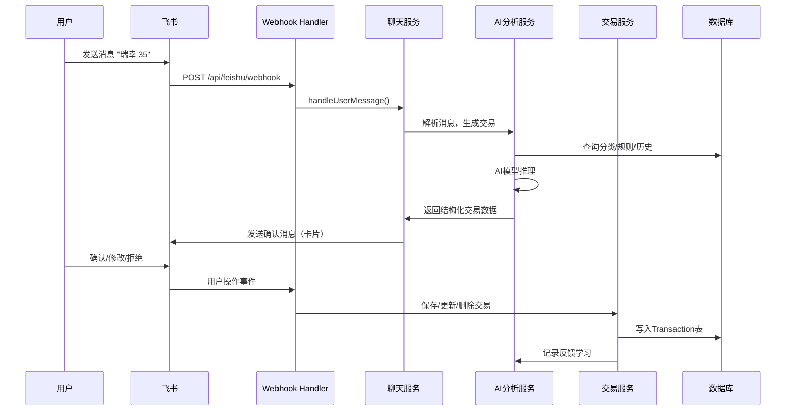
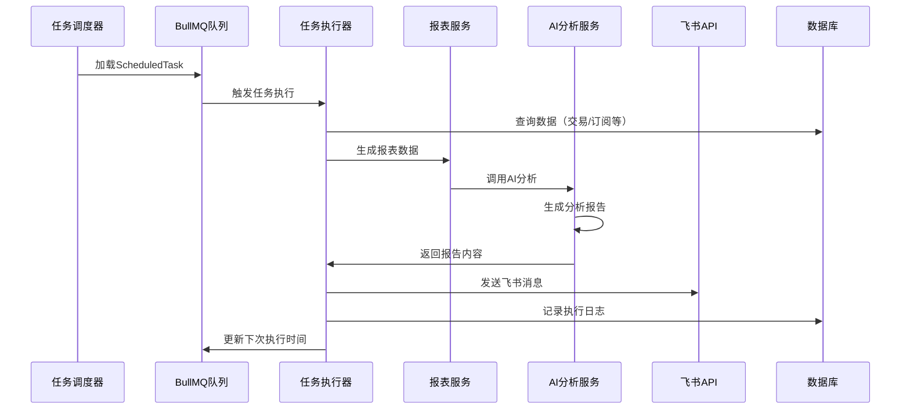
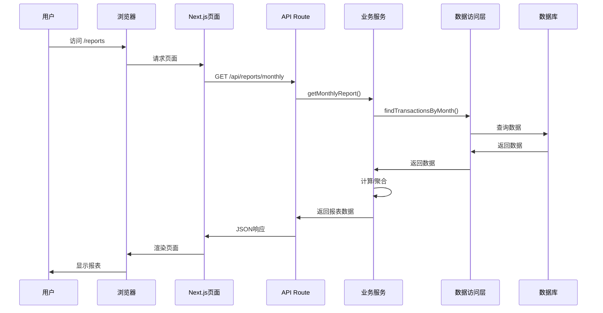

# 开发架构详细设计

> **文档版本**: v1.0  
> **创建日期**: 2026-01-29  
> **关联文档**: `architecture_analysis.md`

---

## 📁 目录结构规划

```
ttmp/
├── app/                          # Next.js App Router
│   ├── api/                      # API Routes
│   │   ├── feishu/               # 飞书相关API
│   │   │   ├── webhook/          # Webhook接收
│   │   │   └── auth/             # 认证相关
│   │   ├── transactions/         # 交易流水API (待创建)
│   │   ├── categories/           # 分类管理API (待创建)
│   │   ├── subscriptions/        # 订阅管理API (待创建)
│   │   ├── reports/              # 报表API (待创建)
│   │   └── scheduled-tasks/      # 定时任务API (待创建)
│   ├── dashboard/                # 仪表盘页面 (待创建)
│   ├── reports/                  # 报表页面 (待创建)
│   ├── categories/               # 分类管理页面 (待创建)
│   ├── subscriptions/            # 订阅管理页面 (待创建)
│   ├── scheduled-tasks/          # 定时任务管理页面 (待创建)
│   ├── review/                   # 记账复核页面 (待创建)
│   ├── amortization/             # 分摊管理页面 (待创建)
│   └── layout.tsx                # 根布局
│
├── lib/
│   ├── repositories/             # 数据访问层 (待创建)
│   │   ├── transaction.repository.ts
│   │   ├── category.repository.ts
│   │   ├── subscription.repository.ts
│   │   ├── report.repository.ts
│   │   └── scheduled-task.repository.ts
│   ├── services/                 # 业务服务层
│   │   ├── transaction.service.ts      # (待创建)
│   │   ├── category.service.ts          # (待创建)
│   │   ├── subscription.service.ts      # (待创建)
│   │   ├── report.service.ts            # (待创建)
│   │   ├── ai-analysis.service.ts       # (待创建)
│   │   ├── scheduled-task.service.ts    # (待创建)
│   │   ├── feishu-chat.ts               # (已存在，需增强)
│   │   └── vision.service.ts            # (已存在)
│   ├── schedulers/               # 定时任务调度器 (待创建)
│   │   ├── task-scheduler.ts
│   │   ├── executors/
│   │   │   ├── daily-report.executor.ts
│   │   │   ├── weekly-report.executor.ts
│   │   │   ├── monthly-report.executor.ts
│   │   │   └── subscription-reminder.executor.ts
│   │   └── queue.ts              # BullMQ队列配置
│   ├── utils/                    # 工具函数 (待创建)
│   │   ├── date.utils.ts
│   │   ├── currency.utils.ts
│   │   └── validation.utils.ts
│   ├── feishu/                   # (已存在)
│   ├── models/                   # (已存在)
│   ├── prompts/                  # (已存在)
│   └── auth.ts                   # (已存在)
│
├── components/                   # React组件
│   ├── ui/                       # 基础UI组件 (待创建)
│   │   ├── Button.tsx
│   │   ├── Card.tsx
│   │   ├── Table.tsx
│   │   └── Chart.tsx
│   ├── features/                 # 功能组件 (待创建)
│   │   ├── TransactionList.tsx
│   │   ├── CategoryManager.tsx
│   │   ├── SubscriptionCard.tsx
│   │   ├── ReportChart.tsx
│   │   └── ReviewPanel.tsx
│   └── FeishuProvider.tsx       # (已存在)
│
├── prisma/
│   └── schema.prisma             # (已存在，需扩展)
│
└── scripts/                      # 脚本工具
    ├── seed.ts                   # 数据种子 (待创建)
    └── migrate.ts                # 迁移脚本 (待创建)
```

---

## 🔄 核心业务流程设计

### 1. 飞书机器人记账流程



### 2. 定时任务执行流程



### 3. Web页面数据流



---

## 🏗️ 模块详细设计

### 1. Repository 层设计

**设计原则**: 
- 单一职责：每个Repository只负责一个实体
- 接口抽象：定义接口，便于测试和扩展
- 查询封装：复杂查询封装为方法

**示例实现**:

```typescript
// lib/repositories/transaction.repository.ts
import { prisma } from '@/lib/prisma';
import type { Transaction, TransactionType, PaymentChannel } from '@/generated/prisma';

export interface CreateTransactionDto {
  transactionId: string;
  date: Date;
  type: TransactionType;
  level1Category: string;
  level2Category: string;
  amount: number;
  paymentChannel: PaymentChannel;
  // ... 其他字段
}

export interface QueryTransactionParams {
  userId?: string;
  startDate?: Date;
  endDate?: Date;
  type?: TransactionType;
  level1Category?: string;
  paymentChannel?: PaymentChannel;
}

export class TransactionRepository {
  async create(data: CreateTransactionDto): Promise<Transaction> {
    return await prisma.transaction.create({ data });
  }

  async findById(transactionId: string): Promise<Transaction | null> {
    return await prisma.transaction.findUnique({
      where: { transactionId }
    });
  }

  async findByDateRange(
    startDate: Date,
    endDate: Date,
    userId?: string
  ): Promise<Transaction[]> {
    return await prisma.transaction.findMany({
      where: {
        date: { gte: startDate, lte: endDate },
        ...(userId && { userId })
      },
      orderBy: { date: 'desc' }
    });
  }

  async findByCategory(
    level1Category: string,
    level2Category: string,
    startDate: Date,
    endDate: Date
  ): Promise<Transaction[]> {
    return await prisma.transaction.findMany({
      where: {
        level1Category,
        level2Category,
        date: { gte: startDate, lte: endDate }
      }
    });
  }

  async update(
    transactionId: string,
    data: Partial<Transaction>
  ): Promise<Transaction> {
    return await prisma.transaction.update({
      where: { transactionId },
      data
    });
  }

  async delete(transactionId: string): Promise<void> {
    await prisma.transaction.delete({
      where: { transactionId }
    });
  }

  async query(params: QueryTransactionParams): Promise<Transaction[]> {
    const where: any = {};
    
    if (params.userId) where.userId = params.userId;
    if (params.startDate || params.endDate) {
      where.date = {};
      if (params.startDate) where.date.gte = params.startDate;
      if (params.endDate) where.date.lte = params.endDate;
    }
    if (params.type) where.type = params.type;
    if (params.level1Category) where.level1Category = params.level1Category;
    if (params.paymentChannel) where.paymentChannel = params.paymentChannel;

    return await prisma.transaction.findMany({
      where,
      orderBy: { date: 'desc' }
    });
  }
}

export const transactionRepository = new TransactionRepository();
```

### 2. Service 层设计

**设计原则**:
- 业务逻辑封装：不直接操作数据库
- 事务管理：复杂操作使用事务
- 错误处理：统一错误类型

**示例实现**:

```typescript
// lib/services/transaction.service.ts
import { transactionRepository } from '@/lib/repositories/transaction.repository';
import { prisma } from '@/lib/prisma';
import type { Transaction, TransactionType } from '@/generated/prisma';

export class TransactionService {
  /**
   * 创建交易流水
   */
  async createTransaction(data: {
    date: Date;
    type: TransactionType;
    level1Category: string;
    level2Category: string;
    amount: number;
    paymentChannel: string;
    userId?: string;
    // ... 其他字段
  }): Promise<Transaction> {
    // 1. 生成交易ID
    const transactionId = this.generateTransactionId(data.date);
    
    // 2. 验证分类是否存在
    await this.validateCategory(data.level1Category, data.level2Category);
    
    // 3. 创建交易
    return await transactionRepository.create({
      transactionId,
      ...data
    });
  }

  /**
   * 批量创建交易（用于AI生成）
   */
  async createTransactionsBatch(
    transactions: Array<Omit<Transaction, 'transactionId' | 'createdAt' | 'updatedAt'>>
  ): Promise<Transaction[]> {
    // 使用事务保证原子性
    return await prisma.$transaction(
      transactions.map(tx => {
        const transactionId = this.generateTransactionId(tx.date);
        return transactionRepository.create({
          transactionId,
          ...tx
        });
      })
    );
  }

  /**
   * 获取月度交易汇总
   */
  async getMonthlySummary(
    year: number,
    month: number,
    userId?: string
  ) {
    const startDate = new Date(year, month - 1, 1);
    const endDate = new Date(year, month, 0, 23, 59, 59);

    const transactions = await transactionRepository.findByDateRange(
      startDate,
      endDate,
      userId
    );

    const income = transactions
      .filter(t => t.type === 'income')
      .reduce((sum, t) => sum + Number(t.amount), 0);
    
    const expense = transactions
      .filter(t => t.type === 'expense' && t.isAnalysis)
      .reduce((sum, t) => sum + Math.abs(Number(t.amount)), 0);

    return {
      income,
      expense,
      netCashflow: income - expense,
      transactionCount: transactions.length
    };
  }

  /**
   * 生成交易ID
   */
  private generateTransactionId(date: Date): string {
    const dateStr = date.toISOString().slice(0, 10).replace(/-/g, '');
    const random = Math.random().toString(36).substring(2, 7).toUpperCase();
    return `TX${dateStr}${random}`;
  }

  /**
   * 验证分类
   */
  private async validateCategory(
    level1: string,
    level2: string
  ): Promise<void> {
    const category = await prisma.category.findUnique({
      where: {
        level1Category_level2Category: {
          level1Category: level1,
          level2Category: level2
        }
      }
    });

    if (!category || !category.isActive) {
      throw new Error(`分类 ${level1}/${level2} 不存在或已停用`);
    }
  }
}

export const transactionService = new TransactionService();
```

### 3. 定时任务调度器设计

```typescript
// lib/schedulers/task-scheduler.ts
import { Queue, Worker } from 'bullmq';
import { prisma } from '@/lib/prisma';
import { sendMessage } from '@/lib/feishu/messages';
import { dailyReportExecutor } from './executors/daily-report.executor';
import { weeklyReportExecutor } from './executors/weekly-report.executor';
import { monthlyReportExecutor } from './executors/monthly-report.executor';

const connection = {
  host: process.env.REDIS_HOST || 'localhost',
  port: parseInt(process.env.REDIS_PORT || '6379'),
};

// 创建队列
export const taskQueue = new Queue('scheduled-tasks', { connection });

// 创建Worker
export const taskWorker = new Worker(
  'scheduled-tasks',
  async (job) => {
    const { taskId, taskType } = job.data;
    
    console.log(`[TaskScheduler] 执行任务: ${taskId} (${taskType})`);

    // 记录开始时间
    const startedAt = new Date();

    try {
      let result: any;

      // 根据任务类型执行不同的执行器
      switch (taskType) {
        case 'daily_report':
          result = await dailyReportExecutor(job.data);
          break;
        case 'weekly_report':
          result = await weeklyReportExecutor(job.data);
          break;
        case 'monthly_report':
          result = await monthlyReportExecutor(job.data);
          break;
        case 'subscription_reminder':
          result = await subscriptionReminderExecutor(job.data);
          break;
        default:
          throw new Error(`未知的任务类型: ${taskType}`);
      }

      // 更新任务执行记录
      await prisma.taskExecutionLog.create({
        data: {
          logId: `LOG${Date.now()}${Math.random().toString(36).substring(2, 7).toUpperCase()}`,
          taskId,
          status: 'success',
          startedAt,
          completedAt: new Date(),
          result: result
        }
      });

      // 更新任务的下次执行时间
      const task = await prisma.scheduledTask.findUnique({
        where: { taskId }
      });

      if (task && task.isActive) {
        const nextRunAt = calculateNextRunTime(task.schedule);
        await prisma.scheduledTask.update({
          where: { taskId },
          data: {
            lastRunAt: startedAt,
            nextRunAt
          }
        });
      }

      return result;
    } catch (error: any) {
      // 记录失败日志
      await prisma.taskExecutionLog.create({
        data: {
          logId: `LOG${Date.now()}${Math.random().toString(36).substring(2, 7).toUpperCase()}`,
          taskId,
          status: 'fail',
          startedAt,
          completedAt: new Date(),
          errorMessage: error.message
        }
      });

      throw error;
    }
  },
  { connection }
);

/**
 * 加载所有活跃的定时任务到队列
 */
export async function loadScheduledTasks() {
  const tasks = await prisma.scheduledTask.findMany({
    where: { isActive: true }
  });

  for (const task of tasks) {
    if (task.nextRunAt && task.nextRunAt <= new Date()) {
      // 立即执行
      await taskQueue.add(
        `task-${task.taskId}`,
        {
          taskId: task.taskId,
          taskType: task.taskType,
          userId: task.userId,
          config: task.config
        },
        {
          jobId: `job-${task.taskId}`,
          repeat: {
            pattern: task.schedule // cron表达式
          }
        }
      );
    }
  }

  console.log(`[TaskScheduler] 已加载 ${tasks.length} 个定时任务`);
}

/**
 * 计算下次执行时间（简化版，实际应使用 cron-parser）
 */
function calculateNextRunTime(cronExpression: string): Date {
  // 这里简化处理，实际应使用 cron-parser 库
  // 示例：每天9点执行 "0 9 * * *"
  const [minute, hour] = cronExpression.split(' ');
  const next = new Date();
  next.setHours(parseInt(hour || '9'), parseInt(minute || '0'), 0, 0);
  
  if (next <= new Date()) {
    next.setDate(next.getDate() + 1);
  }
  
  return next;
}

// 启动时加载任务
if (require.main === module) {
  loadScheduledTasks();
}
```

### 4. 报表服务设计

```typescript
// lib/services/report.service.ts
import { transactionRepository } from '@/lib/repositories/transaction.repository';
import { prisma } from '@/lib/prisma';
import { aiAnalysisService } from './ai-analysis.service';

export interface MonthlyReport {
  month: string;
  income: number;
  expense: number;
  netCashflow: number;
  topCategories: Array<{
    level1Category: string;
    level2Category: string;
    amount: number;
    percentage: number;
  }>;
  aiAnalysis?: string;
}

export class ReportService {
  /**
   * 生成月度报表
   */
  async generateMonthlyReport(
    year: number,
    month: number,
    userId?: string,
    includeAIAnalysis = false
  ): Promise<MonthlyReport> {
    const monthStr = `${year}-${String(month).padStart(2, '0')}`;
    
    // 1. 查询月度快照（如果存在）
    let snapshot = await prisma.monthlyFinancialSnapshot.findUnique({
      where: { month: monthStr }
    });

    // 2. 如果快照不存在或需要更新，实时计算
    if (!snapshot) {
      const startDate = new Date(year, month - 1, 1);
      const endDate = new Date(year, month, 0, 23, 59, 59);

      const transactions = await transactionRepository.findByDateRange(
        startDate,
        endDate,
        userId
      );

      const income = transactions
        .filter(t => t.type === 'income')
        .reduce((sum, t) => sum + Number(t.amount), 0);

      const expense = transactions
        .filter(t => t.type === 'expense' && t.isAnalysis)
        .reduce((sum, t) => sum + Math.abs(Number(t.amount)), 0);

      // 计算Top分类
      const categoryMap = new Map<string, number>();
      transactions
        .filter(t => t.type === 'expense' && t.isAnalysis)
        .forEach(t => {
          const key = `${t.level1Category}/${t.level2Category}`;
          categoryMap.set(key, (categoryMap.get(key) || 0) + Math.abs(Number(t.amount)));
        });

      const topCategories = Array.from(categoryMap.entries())
        .map(([key, amount]) => {
          const [level1, level2] = key.split('/');
          return { level1Category: level1, level2Category: level2, amount };
        })
        .sort((a, b) => b.amount - a.amount)
        .slice(0, 3)
        .map(item => ({
          ...item,
          percentage: (item.amount / expense) * 100
        }));

      snapshot = await prisma.monthlyFinancialSnapshot.upsert({
        where: { month: monthStr },
        create: {
          month: monthStr,
          monthlyIncome: income,
          monthlyExpense: expense,
          netCashflow: income - expense,
          topCategories: JSON.stringify(topCategories)
        },
        update: {
          monthlyIncome: income,
          monthlyExpense: expense,
          netCashflow: income - expense,
          topCategories: JSON.stringify(topCategories)
        }
      });
    }

    // 3. 解析Top分类
    const topCategories = snapshot.topCategories
      ? JSON.parse(snapshot.topCategories)
      : [];

    // 4. AI分析（可选）
    let aiAnalysis: string | undefined;
    if (includeAIAnalysis) {
      aiAnalysis = await aiAnalysisService.generateMonthlyAnalysis(
        year,
        month,
        userId
      );
    }

    return {
      month: monthStr,
      income: Number(snapshot.monthlyIncome),
      expense: Number(snapshot.monthlyExpense),
      netCashflow: Number(snapshot.netCashflow),
      topCategories,
      aiAnalysis
    };
  }

  /**
   * 生成周度报表
   */
  async generateWeeklyReport(
    year: number,
    week: number,
    userId?: string
  ) {
    // 计算周的开始和结束日期
    const startDate = this.getWeekStartDate(year, week);
    const endDate = new Date(startDate);
    endDate.setDate(endDate.getDate() + 6);
    endDate.setHours(23, 59, 59);

    const transactions = await transactionRepository.findByDateRange(
      startDate,
      endDate,
      userId
    );

    // 类似月度报表的计算逻辑
    // ...
  }

  private getWeekStartDate(year: number, week: number): Date {
    // ISO 8601 周计算
    const simple = new Date(year, 0, 1 + (week - 1) * 7);
    const dow = simple.getDay();
    const ISOweekStart = simple;
    if (dow <= 4) {
      ISOweekStart.setDate(simple.getDate() - simple.getDay() + 1);
    } else {
      ISOweekStart.setDate(simple.getDate() + 8 - simple.getDay());
    }
    return ISOweekStart;
  }
}

export const reportService = new ReportService();
```

---

## 🔐 安全设计

### 1. 认证与授权

- **JWT验证**: 所有API请求验证JWT
- **用户隔离**: 查询强制过滤userId
- **权限控制**: 管理操作需要额外权限验证

### 2. 数据安全

- **输入校验**: 使用Zod进行参数校验
- **SQL注入防护**: Prisma自动防护
- **XSS防护**: React自动转义

### 3. 错误处理

```typescript
// lib/utils/errors.ts
export class AppError extends Error {
  constructor(
    public code: string,
    public message: string,
    public statusCode: number = 400
  ) {
    super(message);
    this.name = 'AppError';
  }
}

export class NotFoundError extends AppError {
  constructor(resource: string) {
    super('NOT_FOUND', `${resource} 不存在`, 404);
  }
}

export class UnauthorizedError extends AppError {
  constructor() {
    super('UNAUTHORIZED', '未授权', 401);
  }
}
```

---

## 📊 性能优化策略

### 1. 数据库优化

- **索引优化**: 为常用查询字段建立索引
- **查询优化**: 避免N+1查询，使用include
- **分页**: 大数据量查询使用分页

### 2. 缓存策略

- **Redis缓存**: 月度快照、用户偏好等
- **CDN**: 静态资源使用CDN
- **Next.js缓存**: 利用Next.js内置缓存

### 3. 异步处理

- **队列**: 耗时操作放入队列异步处理
- **流式响应**: 大报表使用流式生成

---

## 📝 开发规范

### 1. 代码规范

- **TypeScript**: 严格模式，禁止any
- **ESLint**: 使用项目配置的ESLint规则
- **命名**: Repository/Service使用类，工具函数使用函数

### 2. Git规范

- **分支**: feature/xxx, fix/xxx
- **提交**: 使用conventional commits

### 3. 测试规范

- **单元测试**: 核心业务逻辑必须有测试
- **集成测试**: API接口需要有集成测试

---

**文档维护**: 本文档应随开发进度持续更新。
